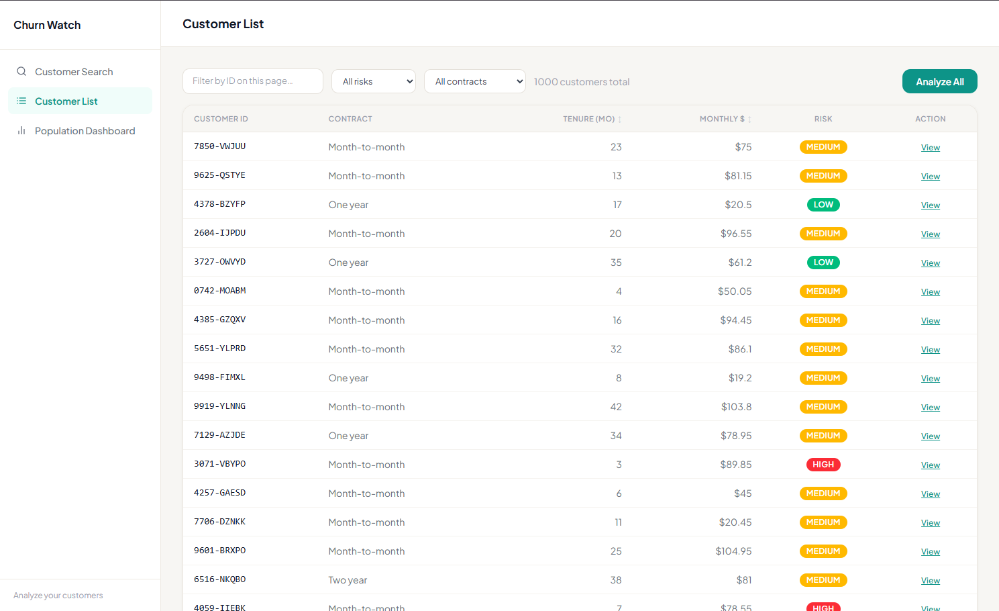
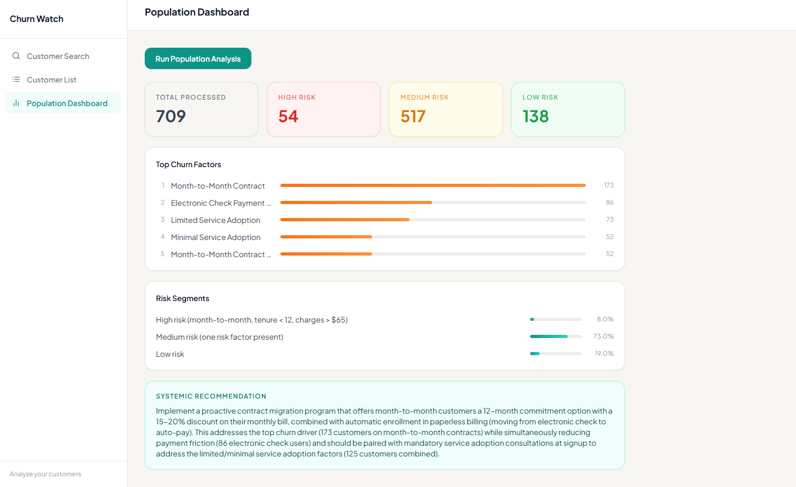

# Churn Watch

Multi-agent customer churn prevention system built on the Telco Customer Churn dataset. Five agents work together to score risk, analyze churn factors, craft personalized retention strategies, and validate output quality — all running under the hood while you browse customers in real time.




## How it works

Customers are loaded from a real telco dataset into Redis. When you analyze a customer, five agents run in a coordinated pipeline:

**Agent 1: Orchestrator**
Pure Python routing — no LLM involved. Fetches the customer profile, runs deterministic risk scoring, and decides which downstream agents to invoke based on risk level.

**Risk Scoring (pure Python)**
Three conditions: month-to-month contract, tenure < 12 months, monthly charges > $65. All three → HIGH. Any one → MEDIUM. None → LOW. No LLM, no guessing.

**Agent 2: Risk Analyst**
Triggered for all customers regardless of risk level. Has a `get_customer_profile` tool and runs a full tool-use loop. Identifies the top 3 churn risk factors with specific references to the customer's actual data — never generic advice.

**Agent 3: Retention Strategist**
Triggered for HIGH risk only. Receives the Risk Analyst's output as context. Crafts a personalized retention strategy with concrete actions, urgency levels, and a specific offer referencing the customer's actual charges and contract.

**Agent 4: Validator**
Lightweight LLM step after the Retention Strategist. Checks whether the strategy is grounded in the actual risk factors and references real customer data. If it fails, the Retention Strategist regenerates once with the validator's feedback. Returns PASS or FAIL.

**Agent 5: Population Intelligence**
Runs separately as a batch analysis. Scans all analyzed customers in Redis, computes risk distribution and top churn factors deterministically in Python, then uses a single LLM call to generate a company-wide systemic recommendation.

## Architecture

```
Frontend (React + TypeScript + Vite)
    |
FastAPI server (async, SSE streaming)
    |
Redis (customer profiles + analysis results)
    |
Python risk scoring (deterministic, no LLM)
    |
Claude Haiku 4.5 (Agents 2, 3, 4, 5)
```

## Stack

| Layer | Tech |
|-------|------|
| Frontend | React, TypeScript, Vite, Tailwind |
| Backend | FastAPI, Uvicorn, asyncio |
| Storage | Redis with connection pooling |
| LLM | Claude Haiku 4.5 via Anthropic SDK (AsyncAnthropic) |
| Streaming | Server-Sent Events (SSE) for batch progress |
| Dataset | WA_Fn-UseC_-Telco-Customer-Churn (Kaggle) |

## Features

- Full 5-agent pipeline with individual tool-use loops — not LLM wrappers
- Deterministic risk scoring in pure Python, never an LLM call
- Validator with one regeneration attempt on failed strategies
- Analyze All with real-time SSE progress bar
- Customer list with server-side filtering by risk level and contract type
- Filter and sort state persists across tab navigation
- Population Intelligence dashboard with top churn factors and systemic recommendation
- View cached results instantly without re-running the pipeline
- Automatic retry with exponential backoff on API rate limits (up to 5 retries)

## Setup

**Prerequisites:** Redis running on `localhost:6379` (Docker example below), Python 3.11+, Node 18+

```bash
# Redis
docker run -d --name redis -p 6379:6379 redis

# Backend
cd backend
python -m venv venv
venv\Scripts\activate        # Windows
pip install -r requirements.txt
cp .env.example .env   # then fill in your ANTHROPIC_API_KEY
python load_data.py          # loads 1000 customers into Redis
python server.py             # starts on http://localhost:8000

# Frontend
cd frontend
npm install
npm run dev                  # starts on http://localhost:5173
```

Open `http://localhost:5173`.
````